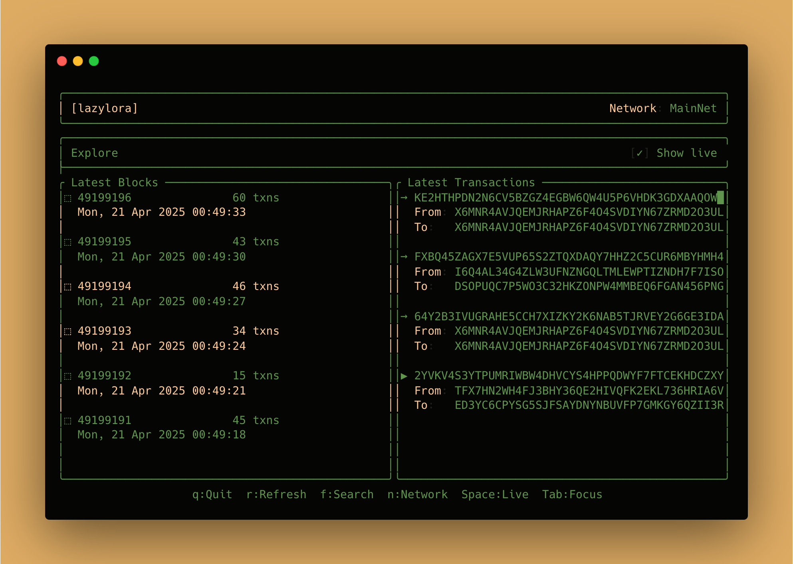

```
██╗      █████╗ ███████╗██╗   ██╗██╗      ██████╗ ██████╗  █████╗ 
██║     ██╔══██╗╚══███╔╝╚██╗ ██╔╝██║     ██╔═══██╗██╔══██╗██╔══██╗
██║     ███████║  ███╔╝  ╚████╔╝ ██║     ██║   ██║██████╔╝███████║
██║     ██╔══██║ ███╔╝    ╚██╔╝  ██║     ██║   ██║██╔══██╗██╔══██║
███████╗██║  ██║███████╗   ██║   ███████╗╚██████╔╝██║  ██║██║  ██║
╚══════╝╚═╝  ╚═╝╚══════╝   ╚═╝   ╚══════╝ ╚═════╝ ╚═╝  ╚═╝╚═╝  ╚═╝
```

> Terminal UI for Algorand blockchain exploration

[](https://github.com/aorumbayev/lazylora/releases/latest)
[](https://opensource.org/licenses/MIT)

LazyLora is a terminal user interface for exploring the Algorand blockchain. It provides a simple and intuitive way to browse blocks and transactions.



## Quick Install

### macOS / Linux

```bash
curl -fsSL https://raw.githubusercontent.com/aorumbayev/lazylora/main/install.sh | bash
```

### Windows

```powershell
iwr -useb https://raw.githubusercontent.com/aorumbayev/lazylora/main/install.ps1 | iex
```

> [!NOTE] ensure you have [Visual C++ Redistributable](https://learn.microsoft.com/en-us/cpp/windows/latest-supported-vc-redist?view=msvc-170) installed.

## Features

- Browse latest blocks and transactions
- Search by transaction ID, account address, block number, or asset ID
- View detailed transaction information with visual graph view
- Live updates of new blocks and transactions
- Support for MainNet, TestNet, and LocalNet
- Direct CLI lookups for transactions, accounts, blocks, and assets

## Usage

```bash
# Run with default settings (mainnet)
lazylora

# Look up a transaction
lazylora -t <TXID>

# Look up an account
lazylora -a <ADDRESS>

# Look up a block
lazylora -b <BLOCK_NUMBER>

# Look up an asset
lazylora -s <ASSET_ID>

# Connect to testnet
lazylora -n testnet

# Open transaction in graph view
lazylora -t <TXID> -g

# Check for updates
lazylora update

# Update to the latest version
lazylora update --install
```

## CLI Reference

| Option | Short | Description |
|--------|-------|-------------|
| `--tx <TXID>` | `-t` | Look up a transaction by ID |
| `--account <ADDRESS>` | `-a` | Look up an account by address |
| `--block <NUMBER>` | `-b` | Look up a block by number |
| `--asset <ID>` | `-s` | Look up an asset by ID |
| `--network <NETWORK>` | `-n` | Network to connect to (mainnet, testnet, localnet) |
| `--graph` | `-g` | Open transaction in graph view |
| `--help` | `-h` | Display help information |
| `--version` | `-V` | Display version information |

## Key Bindings

- `q`: Quit the application
- `r`: Refresh data
- `f`: Search transactions
- `n`: Switch network
- `Space`: Toggle live updates
- `Tab`: Switch between blocks and transactions
- `Enter`: View selected item details
- `Esc`: Close popup or details view
- `v`: Toggle between table and graph view (in transaction details)
- `c`: Copy transaction ID to clipboard

## Building from Source

```bash
# Clone the repository
git clone https://github.com/aorumbayev/lazylora.git
cd lazylora

# Install cargo-nextest for faster test runs (one-time)
cargo install cargo-nextest

# Build and install
cargo build --release

# Run tests
cargo t --all-features
```

## Contributing

Contributions are welcome! Please feel free to submit a Pull Request.

## License

This project is licensed under the MIT License - see the [LICENSE](LICENSE) file for details.
